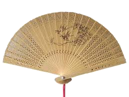

## Ogi

> 
>
> initially written to fan-out bulk topic `labels[app:appname]` tagged logs pushed from Kubernetes to Kafka, into `app` specific topics
>
> evolved to be usable for flexible [ETL](https://en.wikipedia.org/wiki/Extract,_transform,_load) scenarios that can scaled up as multiple instances

---

> _this uses [golang plugins](https://golang.org/pkg/plugin/) for extensibility, currently supported on linux, utilize docker to run if using something else_

[set of configurations to make ogi work to specific behavior](./docs/config-set.md)

---

* [design in detail](./docs/design.md)

* [in-built workflows available](./docs/type.md)

---
